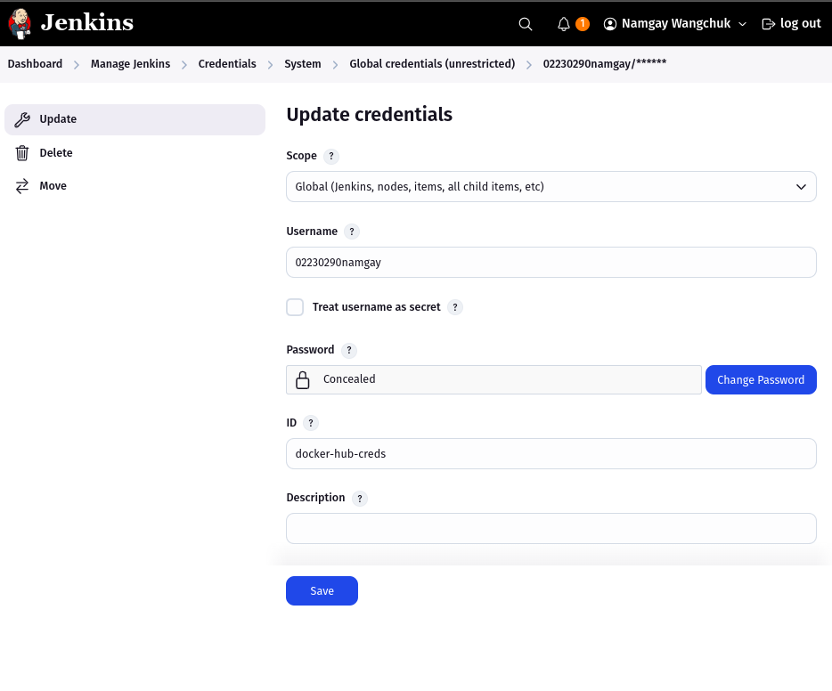
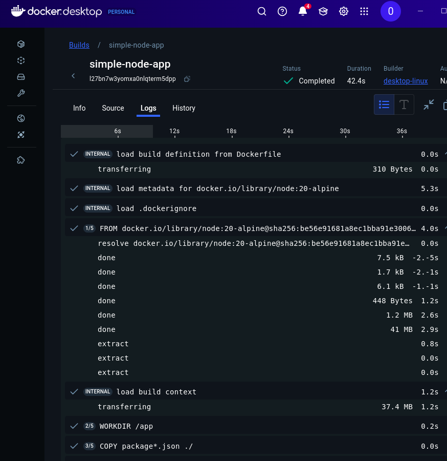

# Declarative Pipeline for Jenkins and Using External Services

## Overview

This project builds upon the `simple-node-app` used in Practical 4. It demonstrates the use of **Jenkins Declarative Pipelines** to automate the build, test, and deployment stages of a Node.js application. Additionally, it extends the pipeline by incorporating **Docker** for containerization and **Docker Hub** for image hosting.

## Part 1: Guided Exercise – Jenkins Pipeline

### Goal

Use Jenkins to automate:

- Installation of Node.js dependencies
- Building the application
- Running tests and publishing results
- Deploying the app based on the branch

### Prerequisites

- Jenkins server with:
  - NodeJS plugin
  - Git plugin
- Node.js app (`simple-node-app`)
- GitHub repository
- Basic Docker and npm knowledge


### Jenkins Setup

1. **Install Node.js Plugin:**

   - Go to **Manage Jenkins → Manage Plugins → Available**
   - Search for and install the **NodeJS** plugin

   

2. **Configure Node.js in Jenkins:**

   - Go to **Manage Jenkins → Global Tool Configuration**
   - Add a Node.js version (e.g., `NodeJS-24.0.2`)

   

3. **Create a New Pipeline Job:**

   - From Jenkins Dashboard → **New Item**
   - Choose **Pipeline**
   - Under **Pipeline → Definition**: Select *Pipeline script from SCM*
   - **SCM**: Git → Add repository URL
   - **Script Path**: `Jenkinsfile`

   

   


### Jenkinsfile (Basic)

```groovy
pipeline {
  agent any

  tools {
    nodejs 'NodeJS-24.0.2' 
  }

  environment {
    CI = 'true'
  }

  stages {
    stage('Install') {
      steps {
        sh 'npm install'
      }
    }

    stage('Build') {
      steps {
        sh 'npm run build'
      }
    }

    stage('Test') {
      steps {
        sh 'npm test'
      }
      post {
        always {
          junit 'junit.xml'
        }
      }
    }

    stage('Deploy') {
      steps {
        script {
          if (env.BRANCH_NAME == 'main') {
            sh 'npm run deploy:prod'
          } else {
            sh 'npm run deploy:stage'
          }
        }
      }
    }
  }
}
```

## Part 2: Docker Build and Push Integration

### Goal
- Extend the pipeline to:

    - Build a Docker image

    - Push to Docker Hub

    - Use Jenkins credentials securely

## Additional Configuration

1. **Docker Installation on Jenkins Server**

2. **Docker Hub Credentials in Jenkins**

    - Go to **Manage Jenkins** → **Credentials**

    - Add Docker Hub username and password

    - Note the credentials ID (e.g., `docker-hub-creds`)

    


To extend the pipeline, I containerized the application and pushed the image to Docker Hub.

### Dockerfile
```
FROM node:20-alpine

WORKDIR /app

COPY package*.json ./
RUN npm install

COPY . .

EXPOSE 3000

CMD ["npm", "start"]
```

### Local Docker Testing
Before configuring Jenkins, I tested the Docker image locally:

```
docker build -t simple-node-app:local .
docker run -p 3000:3000 simple-node-app:local
```

This ensured the image worked correctly before pushing it through Jenkins.




### Extended Jenkinsfile

```
pipeline {
  agent any

  tools {
    nodejs 'NodeJS-24.0.4'
  }

  environment {
    CI = 'true'
    DOCKER_IMAGE = "02230290namgay/simple-node-app"
    DOCKER_CREDENTIALS_ID = "docker-hub-creds"
  }

  stages {
    stage('Install') {
      steps {
        sh 'npm install'
      }
    }

    stage('Build') {
      steps {
        sh 'npm run build'
      }
    }

    stage('Test') {
      steps {
        sh 'npm test'
      }
      post {
        always {
          junit 'junit.xml'
        }
      }
    }

    stage('Docker Build') {
      steps {
        script {
          dockerImage = docker.build("${DOCKER_IMAGE}:${BUILD_NUMBER}")
        }
      }
    }

    stage('Docker Push') {
      steps {
        script {
          docker.withRegistry('', DOCKER_CREDENTIALS_ID) {
            dockerImage.push()
            dockerImage.push('latest')
          }
        }
      }
    }

    stage('Deploy') {
      steps {
        script {
          if (env.BRANCH_NAME == 'main') {
            sh 'echo Deploying to production...'
          } else {
            sh 'echo Deploying to staging...'
          }
        }
      }
    }
  }
}
```

**Run pipeline in Jenkins**


**Images in Dockehub**


## Challenges and Solutions

| Challenge                     | Solution                                                                 |
|------------------------------|--------------------------------------------------------------------------|
| Docker image push failed     | Added correct Docker Hub credentials via Jenkins credentials store       |
| Jenkins could not find Node.js | Matched tool name exactly in Jenkinsfile and Global Tool Configuration |
| Environment variable issues  | Defined required variables like `CI`, `DOCKER_IMAGE`, and `DOCKER_CREDENTIALS_ID` in the `environment` block |


## Conclusion

This practical successfully automates the CI/CD lifecycle of a Node.js app using Jenkins and Docker. The process ensures that:

- Every commit goes through installation, build, test, and deployment.

- Docker images are versioned and pushed securely to Docker Hub.

- Branch-based deployment logic supports both staging and production environments.
