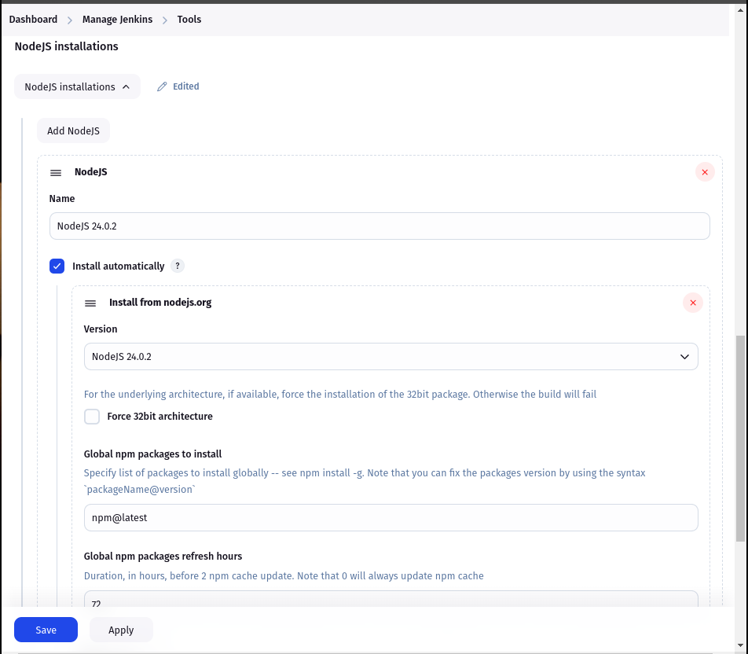
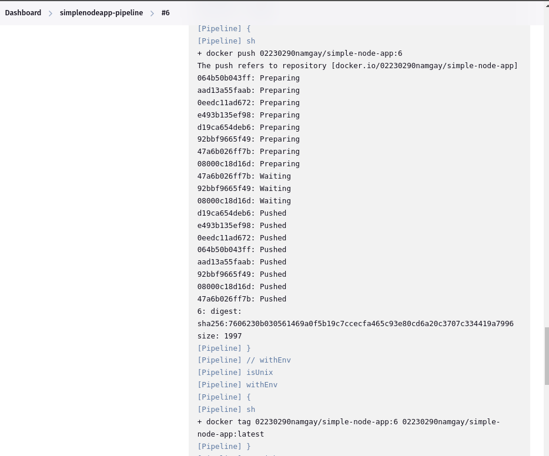
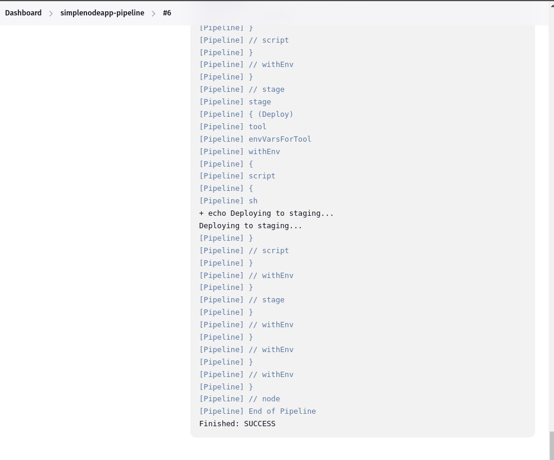

# Jenkins Server for a Git Repository

## Overview

This practical demonstrates setting up a CI/CD pipeline using Jenkins to automate building, testing, and deploying a Node.js application. The exercise covers installing required plugins, configuring Jenkins, setting up a pipeline job, and integrating automated testing and test reporting using Jest and JUnit.

---

## Part 1: Guided Exercise

### Prerequisites

- Jenkins installed and running locally or on a cloud server.
- Node.js and npm installed on the Jenkins server.
- A Node.js-based Git repository (used: [simple-node-app](https://github.com/Namgay282004/simple-node-app)).

---

### 1. Installed Plugins

Via: `Manage Jenkins → Manage Plugins`

- **NodeJS Plugin**: For auto-installing Node.js in jobs.
- **Git Plugin**: For integrating Git SCM.
- **Pipeline Plugin**: For creating pipelines as code.

    
---

### 2. Configured Node.js in Jenkins

Via: `Manage Jenkins → Global Tool Configuration`

- **NodeJS**: Added a new Node.js installation named `NodeJS-24.0.2`.
- Automatically installed version: `24.0.2`.

    
---


### 3. Created a Pipeline Job

Via: `New Item → Pipeline`

- **Definition**: Pipeline script from SCM
- **SCM**: Git
- **Repository URL**: `https://github.com/Namgay282004/simple-node-app.git`
- **Script Path**: `Jenkinsfile`

    

    

    

---

### 4. Jenkinsfile Used

Implemented Multi-Stage Pipeline : Jenkinsfile
- Checkout
- Install Dependencies
- Run Tests
- Build
- Archive Artifacts
- Deploy

```groovy
pipeline {
  agent any
  tools {
    nodejs 'NodeJS-24.0.2'
  }

  stages {
    stage('Install') {
      steps {
        sh 'npm install'
      }
    }

    stage('Test') {
      steps {
        sh 'npm test -- --ci --reporters=jest-junit'
      }
      post {
        always {
          junit 'junit.xml'
        }
      }
    }

    stage('Build') {
      steps {
        sh 'npm run build'
      }
    }

    stage('Deploy') {
      steps {
        sh 'echo "Deploying to staging..."'
      }
    }
  }
}
```

### Run pipeline in jenkins





## Part 2: Challenge – Test Reporting

### JUnit Plugin Installed

Via: `Manage Jenkins` → `Manage Plugins`

- **JUnit Plugin**: Enables parsing and publishing test results.

### Test Configuration
- Used Jest as the testing framework.

- Updated package.json scripts:

```
"scripts": {
  "test": "jest",
  "test:ci": "jest --ci --reporters=jest-junit --coverage"
}
```

### Challenges Faced
1. ***Test Stage Failed Due to Missing Files**

- Jenkins was unable to locate valid test files during the npm test stage.

- Solution: Realized that test files were not following the default Jest naming conventions (e.g., *.test.js).

## Conclusion
- Set up Jenkins pipelines for Node.js applications.

- Integrated Jest testing with CI pipeline.

- Published JUnit-compatible test reports in Jenkins.

- Troubleshot build and test failures through Jenkins console logs.
